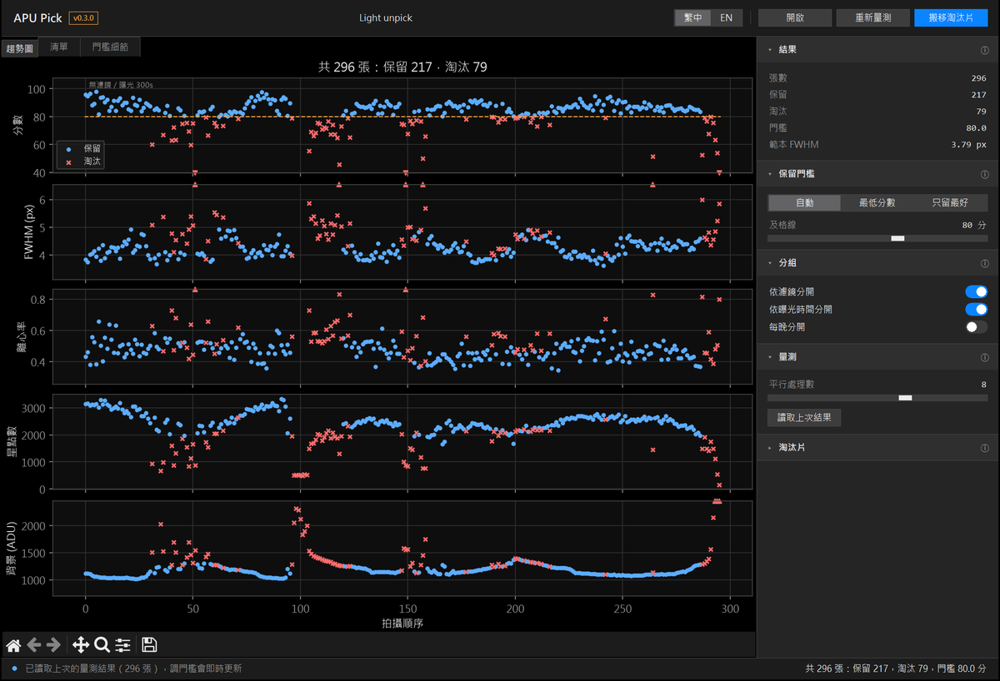

  

自動幫你從一整批 light frames 裡挑出好片、把爛片移開的小工具。

程式會量每張的星點大小（FWHM）、拖線程度（離心率）、星點數和背景亮度，跟同一批裡最好的片比較後打分數，
低於門檻的搬到 `rejected` 資料夾。疊圖前先跑一次，就不用再一張一張用肉眼看。

*NGC7635，4 個晚上共 296 張，自動留下 217 張*

## 特色

- **自動評分**：每張 0~100 分，跟同一批最好的片比較，不用自己決定 FWHM 要幾像素才算好
- **趨勢圖**：分數和各項指標依拍攝順序排開，哪段有雲、哪段仰角太低、什麼時候天亮，一眼就看得出來
- **門檻隨你調**：自動、最低分數、只留最好的 X%，改了馬上看到結果
- **只搬檔、不刪檔**：淘汰的片搬到子資料夾，一鍵就能全部還原
- **分組評分**：不同濾鏡、曝光時間自動分開算，L 和 Ha 不會互相比較；多晚的資料也能每晚分開算
- 單色、彩色（OSC）相機的 FITS 檔都支援
- 介面可以切換繁體中文 / English

## 下載

到 [Releases 頁面](../../releases/latest) 下載對應的檔案，不用另外安裝 Python：

| 系統 | 檔案 |
|---|---|
| Windows 10 / 11（64 位元） | `APUPick-版本-win64.zip` |
| Mac（Apple M 系列晶片） | `APUPick-版本-macos-arm64.zip` |
| Mac（Intel 處理器） | `APUPick-版本-macos-x86_64.zip` |

### Windows

1. 在下載的 zip 上按右鍵 →「**全部解壓縮**」
2. 打開解壓出來的資料夾，雙擊 `APUPick.exe`

> 第一次開啟時，Windows 可能會跳出「Windows 已保護您的電腦」。這是因為程式沒有購買數位簽章，
> 按「**其他資訊**」→「**仍要執行**」即可。

### Mac（測試中）

1. 雙擊下載的 zip 解壓縮，把 `APUPick.app` 拖到「應用程式」資料夾
2. 第一次開啟會被系統擋下，因為程式沒有 Apple 的付費簽章：
   到「**系統設定**」→「**隱私權與安全性**」，往下捲會看到 APUPick 被阻擋的訊息，按「**仍要打開**」，
   輸入密碼後再按一次「打開」就可以了

不知道自己的 Mac 是哪一種？點左上角蘋果選單 →「關於這台 Mac」，晶片寫 Apple M1、M2… 就是 M 系列，寫 Intel 就是 Intel。

> Mac 版是在雲端自動打包的，作者手邊沒有 Mac 可以實際操作，遇到問題請告訴我。

## 使用方式

1. 按右上角 **開啟**，選放 light frames 的資料夾（Windows 也可以把資料夾直接拖到 exe 上）
2. 按 **量測**：幾百張大約幾分鐘，進度和剩餘時間顯示在最下面的狀態列，量測中可以按 **停止**
3. 看趨勢圖和清單，需要的話在右側「**保留門檻**」調整，畫面會立刻更新
4. 滿意後按右上角 **搬移淘汰片**，淘汰的片會搬到 `rejected` 子資料夾
5. 搬錯了就在右側「**淘汰片**」按 **全部還原…**，全部搬回原位

右上角的「繁中｜EN」可以切換介面語言；右側每一組標題旁的 ⓘ 有詳細說明。

量測結果會存成資料夾裡的 `selection_report.csv`，下次打開同一個資料夾會自動讀取，不用重新量測。
門檻放寬後再按一次搬移，變成保留的片會自動搬回來。

## 評分方式

1. 每張量 4 個指標：**FWHM**（星點大小）、**離心率**（拖線程度）、**星點數**（透明度）、**背景**（天空亮度）
2. 每個指標取這一批最好的 10% 平均，當作「範本」
3. 每張的各項指標跟範本比較，換算成 0~1（跟範本一樣好就是 1）
4. 加權相加再 × 100 就是分數：FWHM 35%、離心率 30%、星點數 20%、背景 15%
5. 自動門檻：「分數眾數 − 1.5 × MAD」和「80 分」取較高者

完全量不到星的片（例如整張被雲遮住）會直接淘汰。「清單」分頁有每張的分數和弱項，
「門檻細節」分頁有範本和門檻的計算過程。

## 常見問題

**打不開？**

- Windows：要先解壓縮，不能直接在 zip 裡面點；`APUPick.exe` 要跟旁邊的 `_internal` 資料夾放在一起，
  想放在桌面的話請用「建立捷徑」
- Mac：請看上面「Mac」的說明

**支援哪些檔案？**

FITS 檔（`.fit`、`.fits`、`.fts`），單色和彩色相機都可以。XISF 目前不支援。

**用 PixInsight WBPP 疊圖要注意什麼？**

WBPP 的「+ Directory」會連子資料夾一起加入，`rejected` 裡的片也會被加進去。
可以改用「+ Lights」只選外層的檔案，或在右側「淘汰片」按「變更…」，把淘汰片資料夾改到 light 資料夾外面。

**量測時電腦很卡？**

把右側「量測」裡的「平行處理數」調低。數字越大越快，但也越吃記憶體。

**會刪掉我的檔案嗎？**

不會。程式只會搬移檔案，不會刪除任何東西。

## 意見回饋

有問題或建議，直接到 Threads 私訊我：[@apu_astrophotography](https://www.threads.com/@apu_astrophotography)

也可以到 [Issues](../../issues) 留言。

## 進階

命令列版、完整參數、自己打包的方法，請看[進階說明](docs/advanced.md)。

## 授權

[MIT License](LICENSE)
