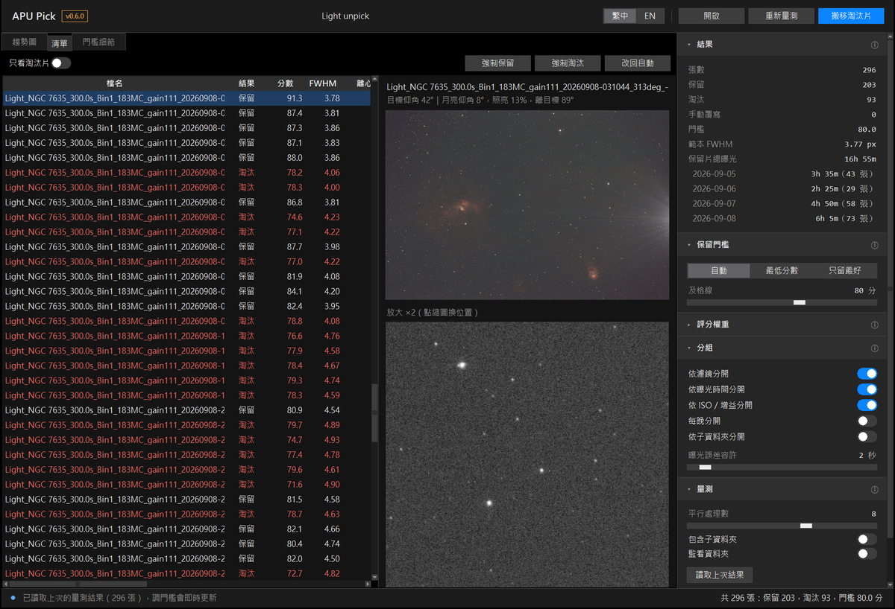

  

自動幫你從一整批 light frames 裡挑出好片、把爛片移開的小工具。

程式會量每張的星點大小（FWHM）、拖線程度（離心率）、星點數和背景亮度，跟同一批裡最好的片比較後打分數，
低於門檻的搬到 `rejected` 資料夾。疊圖前先跑一次，就不用再一張一張用肉眼看。

*NGC7635，4 個晚上共 296 張，自動留下 203 張。最下面一格是目標仰角和月亮*

## 特色

- **自動評分**：每張 0~100 分，跟同一批最好的片比較，不用自己決定 FWHM 要幾像素才算好
- **趨勢圖**：分數和各項指標依拍攝順序排開，哪段有雲、哪段仰角太低、什麼時候天亮，一眼就看得出來
- **拍攝資訊**：從 FITS header 算出每張拍攝時的目標仰角、月亮仰角、月亮離目標多遠和月相，畫在趨勢圖上
- **預覽**：點清單裡的一張，旁邊顯示自動拉伸的縮圖和放大的星點，拖線、失焦用眼睛確認
- **手動覆寫**：覺得程式判斷錯了，可以強制保留或淘汰，重新評分也會記得；清單上按 K／X 就能一張一張快速決定
- **門檻與權重隨你調**：自動、最低分數、只留最好的 X%；五個指標的權重也能自己調，改了馬上看到結果；
  滑桿旁的數字點一下可以直接輸入
- **保留片總曝光**：挑完馬上知道留下多少時數，每組、每晚各列一行
- **監看資料夾**：拍攝時打開，新拍好的片自動量測，邊拍邊看這晚的品質
- **只搬檔、不刪檔**：淘汰的片搬到子資料夾，一鍵就能全部還原
- **分組評分**：不同濾鏡、曝光時間、ISO／增益自動分開算，L 和 Ha 不會互相比較；多晚的資料也能每晚分開算
- **一次處理多個資料夾**：單眼每晚一個資料夾也沒問題，開最上層就全部一起挑，淘汰片各自搬到那一晚的資料夾裡
- **整理檔案**：同一個資料夾混了多台相機、多個濾鏡或多種曝光，可以依參數搬進子資料夾（例如 `ASI2600MC/Ha/300s/`），隨時能復原
- 天文相機的 FITS（單色、彩色都可以），以及各廠牌單眼／無反的 RAW 檔
- 介面可以切換繁體中文 / English

## 下載

到 [Releases 頁面](../../releases/latest) 下載對應的檔案，不用另外安裝 Python：

| 系統 | 檔案 |
|---|---|
| Windows 10 / 11（64 位元） | `APUPick-版本-win64.zip` |
| Mac（Apple M 系列晶片） | `APUPick-版本-macos-arm64.zip` |
| Mac（Intel 處理器） | `APUPick-版本-macos-x86_64.zip` |

### Windows

1. 在下載的 zip 上按右鍵 →「**全部解壓縮**」
2. 打開解壓出來的資料夾，雙擊 `APUPick.exe`

> 第一次開啟時，Windows 可能會跳出「Windows 已保護您的電腦」。這是因為程式沒有購買數位簽章，
> 按「**其他資訊**」→「**仍要執行**」即可。

### Mac

1. 雙擊下載的 zip 解壓縮，把 `APUPick.app` 拖到「應用程式」資料夾
2. 雙擊 APUPick。第一次會跳出「Apple無法驗證『APUPick』是否為惡意軟體…」，按「**完成**」
   （不要按「丟到垃圾桶」）。這是因為程式沒有購買 Apple 的付費簽章，不是程式有問題
3. 點左上角蘋果選單 →「**系統設定**」→ 左邊的「**隱私權與安全性**」
4. 右邊往下捲到「**安全性**」，會看到「已阻擋『APUPick』以保護你的Mac。」，按旁邊的「**強制打開**」
5. 接著會要你輸入 Mac 的登入密碼（或按 Touch ID），再跳出詢問時一樣按「**強制打開**」

只有第一次要這樣做，之後雙擊就能直接開。第一次開啟時程式要整理系統字型，視窗大約 20 秒才出現，
之後幾秒就開好；等待時不用重複雙擊。

不知道自己的 Mac 是哪一種？點左上角蘋果選單 →「關於這台 Mac」，晶片寫 Apple M1、M2… 就是 M 系列，寫 Intel 就是 Intel。

> M 系列版已在 Mac 上實際操作測試；Intel 版是雲端自動打包的，還沒實際操作過，遇到問題請告訴我。

## 使用方式

1. 按右上角 **開啟**，選放 light frames 的資料夾（Windows 也可以把資料夾直接拖到 exe 上）
2. 按 **量測**：幾百張大約幾分鐘，進度和剩餘時間顯示在最下面的狀態列，量測中可以按 **停止**
3. 看趨勢圖和清單，需要的話在右側「**保留門檻**」調整，畫面會立刻更新
4. 在「**清單**」點一張片可以看預覽；想推翻程式的判斷，按上面的 **強制保留**／**強制淘汰**（或按右鍵），
   **改回自動** 就恢復。也可以直接按鍵：**K** 強制保留、**X** 強制淘汰、**A** 改回自動，
   只選一張時會接著跳到下一張，用上下鍵翻預覽、一張一張決定（注音等輸入法要先切到英數）。
   在趨勢圖上點一下某個點，會跳到清單裡的那一張
5. 滿意後按右上角 **搬移淘汰片**，淘汰的片會搬到 `rejected` 子資料夾
6. 搬錯了就在右側「**淘汰片**」按 **全部還原…**，全部搬回原位

右上角的「繁中｜EN」可以切換介面語言；右側每一組標題旁的 ⓘ 有詳細說明。

量測結果會存成資料夾裡的 `selection_report.csv`，下次打開同一個資料夾會自動讀取，不用重新量測。
門檻放寬後再按一次搬移，變成保留的片會自動搬回來。

**邊拍邊挑**：開啟拍攝存檔的資料夾，打開右側「量測」的 **監看資料夾**，每 10 秒會檢查一次，
新的片寫完就自動量測、加進趨勢圖。只量測不搬檔，拍完再自己按搬移。

**多晚分好幾個資料夾**：例如 `light/iso800/2026-01-01/`、`2026-02-02/`… 直接開最上層的 `light`，
程式會自動「包含子資料夾」一次處理，淘汰片搬到每一晚自己資料夾裡的 `rejected`。
預設整批一起比；想每晚各自比較，在右側「分組」打開 **依子資料夾分開**。
名稱含 dark、flat、bias、master、calibrated 的資料夾會跳過。
想把淘汰片集中到別的地方再挑一次，在右側「淘汰片」按 **變更…**：會照原本的子資料夾結構放
（例如 `目的地/2026-01-01/DSC00001.ARW`），每晚同名的檔案不會撞在一起，全部還原也搬得回去。

**一個資料夾混了好幾種拍攝**：先量測，再到右側「**整理檔案**」勾要依哪些參數分（相機、濾鏡、曝光時間、
ISO／增益、每晚），按 **整理…**，影像會搬進像 `ASI2600MC/Ha/300s/` 這樣的子資料夾，量測結果和手動覆寫跟著走，
不用重新量測。按 **復原整理** 全部搬回原位。

檔案被搬動過（例如從每晚的子資料夾全部移回同一層），再打開時會用檔名認回上次的量測結果，不用重新量測
（同一個檔名出現好幾次的不會猜，要重新量測那幾張）。

## 評分方式

1. 每張量 5 個指標：**FWHM**（星點大小）、**離心率**（拖線程度）、**星點數**（透明度）、**背景**（天空亮度）、
   **SNR**（亮星的訊號比背景雜訊，薄雲、天亮都會讓它下降）
2. 每個指標取這一批最好的 10% 平均，當作「範本」
3. 每張的各項指標跟範本比較，換算成 0~1（跟範本一樣好就是 1）
4. 加權相加再 × 100 就是分數。建議權重：FWHM 35%、離心率 30%、星點數 20%、背景 15%、SNR 0%，
   可以在右側「**評分權重**」自己調，按「恢復建議值」回到預設
5. 自動門檻：「分數眾數 − 1.5 × MAD」和「80 分」取較高者

完全量不到星的片（例如整張被雲遮住）會直接淘汰。「清單」分頁有每張的分數和弱項，
「門檻細節」分頁有範本和門檻的計算過程。

## 常見問題

**打不開？**

- Windows：要先解壓縮，不能直接在 zip 裡面點；`APUPick.exe` 要跟旁邊的 `_internal` 資料夾放在一起，
  想放在桌面的話請用「建立捷徑」
- Mac：請看上面「Mac」的說明

**支援哪些檔案？**

- 天文相機：FITS（`.fit`、`.fits`、`.fts`），單色和彩色都可以
- 單眼／無反：Canon（`.CR2`、`.CR3`）、Nikon（`.NEF`）、Sony（`.ARW`）、Fujifilm（`.RAF`）、OM System / Olympus（`.ORF`）、Panasonic（`.RW2`）、Pentax（`.PEF`）、`.DNG`

XISF 目前不支援。單眼的 B 快門計時常有一兩秒誤差（例如 301、302 秒），右側「分組」的「曝光誤差容許」範圍內會算成同一組。

**趨勢圖沒有「仰角」那一格？**

要算仰角和月亮，FITS header 裡要有目標座標（`RA`/`DEC` 或 `OBJCTRA`/`OBJCTDEC`）、拍攝地點（`SITELAT`/`SITELONG`）
和拍攝時間。ASIAIR、N.I.N.A. 這類拍攝軟體通常會寫；單眼的 RAW 檔沒有這些資訊，所以不會顯示。

**用 PixInsight WBPP 疊圖要注意什麼？**

WBPP 的「+ Directory」會連子資料夾一起加入，`rejected` 裡的片也會被加進去。
可以改用「+ Lights」只選外層的檔案，或在右側「淘汰片」按「變更…」，把淘汰片資料夾改到 light 資料夾外面。
（包含子資料夾時也可以改，會照原本的子資料夾結構放過去。）
**量測時電腦很卡？**

把右側「量測」裡的「平行處理數」調低。數字越大越快，但也越吃記憶體。

**會刪掉我的檔案嗎？**

不會。程式只會搬移檔案，不會刪除任何東西。

## 意見回饋

有問題或建議，直接到 Threads 私訊我：[@apu_astrophotography](https://www.threads.com/@apu_astrophotography)

也可以到 [Issues](../../issues) 留言。

## 進階

命令列版、完整參數、自己打包的方法，請看[進階說明](docs/advanced.md)。

## 授權

[MIT License](LICENSE)
